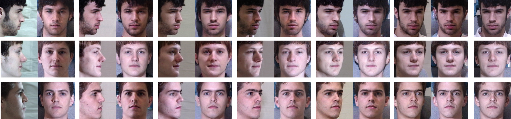
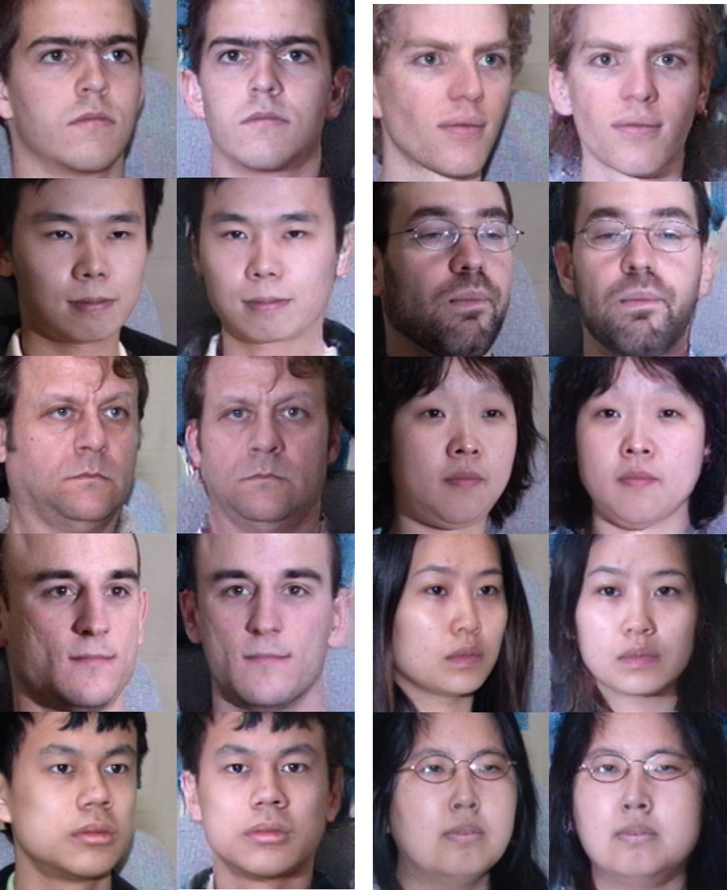
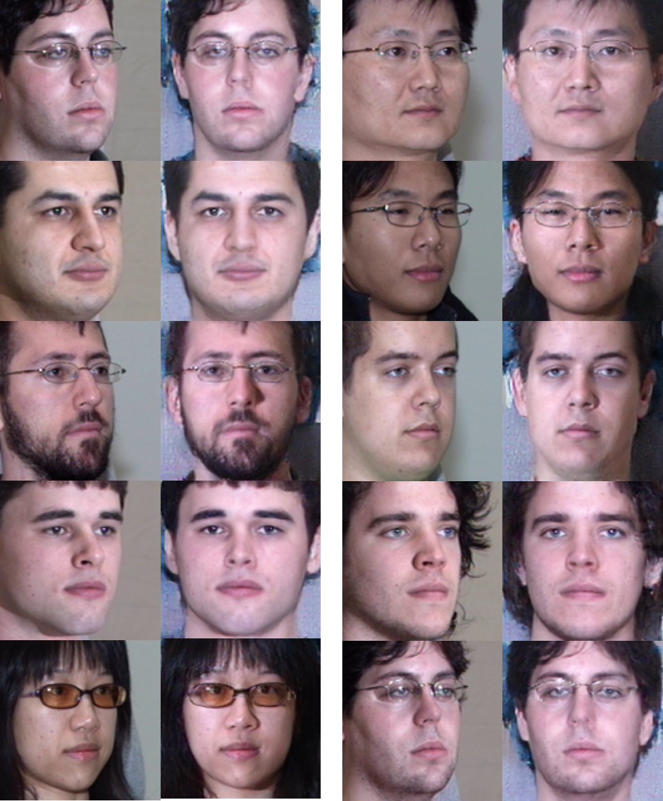
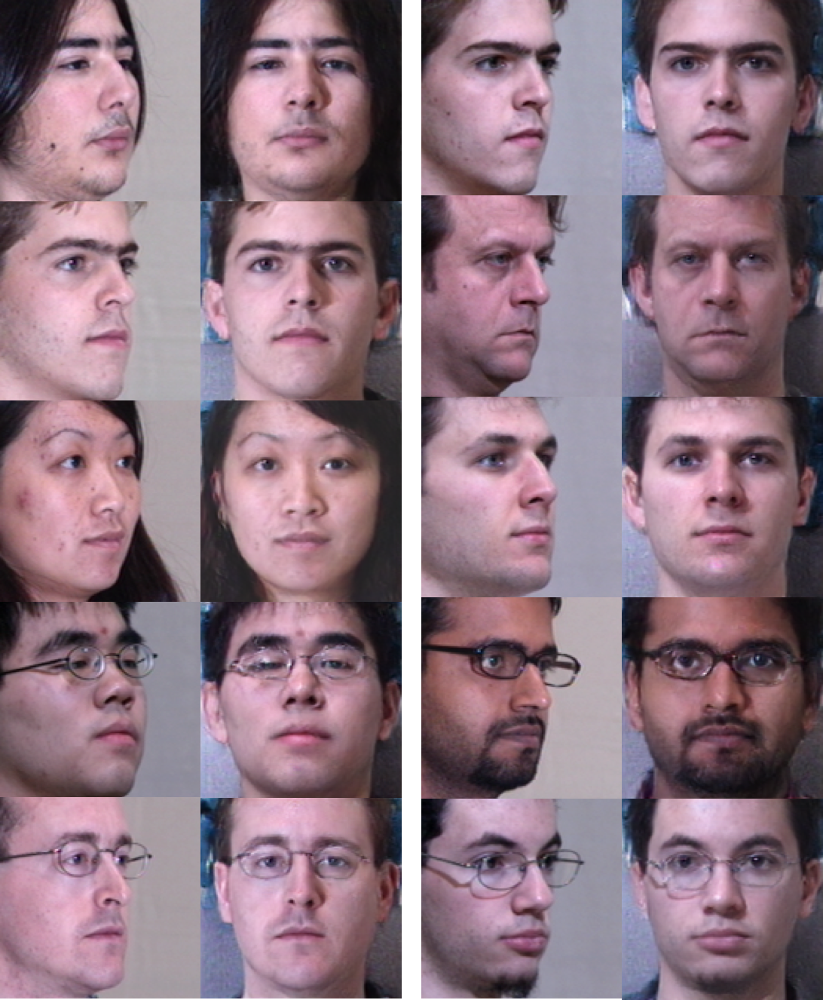
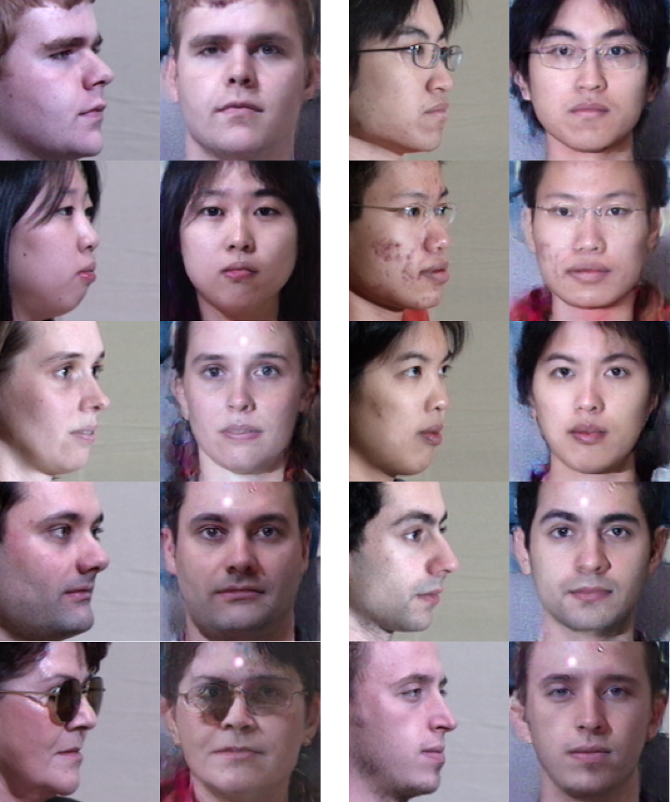
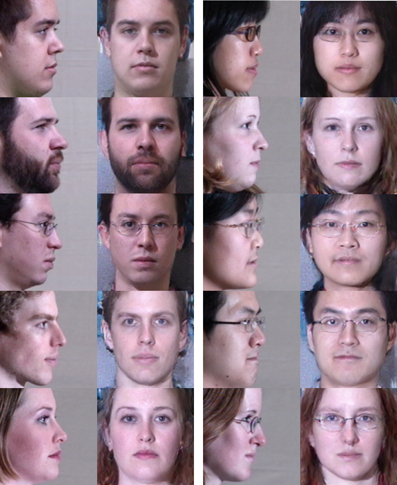
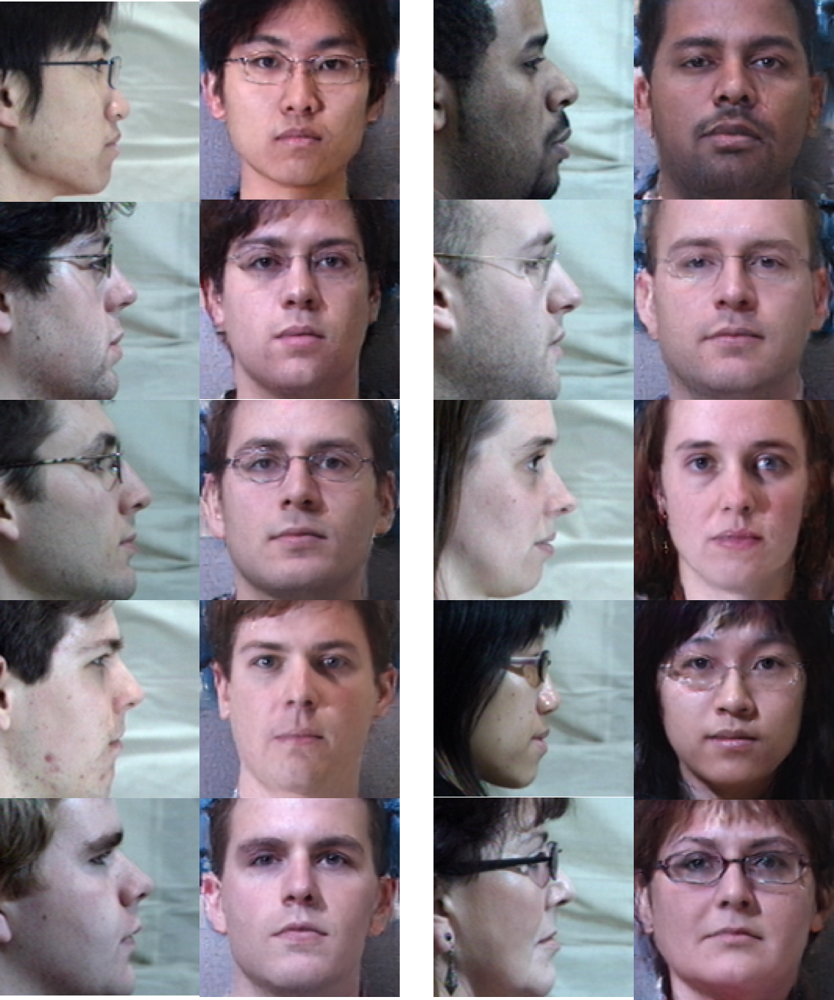

# TP-GAN

Official TP-GAN Tensorflow implementation for the ICCV17 paper "[Beyond Face Rotation: Global and Local Perception GAN for Photorealistic and Identity Preserving Frontal View Synthesis](http://openaccess.thecvf.com/content_ICCV_2017/papers/Huang_Beyond_Face_Rotation_ICCV_2017_paper.pdf)" by [Huang, Rui](http://www.andrew.cmu.edu/user/ruih2/) and Zhang, Shu and Li, Tianyu and [He, Ran](http://www.nlpr.ia.ac.cn/english/irds/People/rhe.html).

The goal is to **recover a frontal face image of the same person from a single face image under any poses**.

Here are some examples from the paper.

### Testing images

Synthesized  testing images of all poses, corresponding illumination in Setting 2 (and its cropped input) in MultiPIE can be obtained here [Google Drive](https://drive.google.com/file/d/1Kx0sMjFTzLX3-rZ03TAVBAj-gcd9rJrd/view?usp=sharing). 

FAQ: **Synthesized**(not the original) images for other illumination condition and/or training set can be obtained upon request. Unfortunately, I cannot redistribute the original dataset due to copyright. If you would like to access the original MultiPIE dataset, please contact [MultiPIE](http://www.cs.cmu.edu/afs/cs/project/PIE/MultiPie/Multi-Pie/Home.html).

### Random examples

Here are random examples of 10 testing image pairs for each degree.

15 and 30 degrees: 

   

 

45 and 60 degrees:

   

 

75 and 90 degrees:

   

 

### Note

It was initially written in Tensorflow 0.12. If you have implemented another version, I'll be happy to reference it here.

This is an initial release of code, which may not be fully tested. Refinement, input data example, pre-trained models, and precomputed testing image features will come later.

The input is cropped with the Matlab script `face_db_align_single_custom.m`, which accepts 5 keypoints and outputs a cropped image and transformed keypoints.

Some example cropping outputs is shown in folder `data-example`.

Our 90-degree model only used 45-90 degree images for training. Other models we trained didn't use 90 degree images. 90 degree images' left and right eye patches coincide.

The 5 keypoints can be extracted from off-the-shelf landmark detectors, e.g. 'Zhang et al. Combining Data-driven and Model-driven Methods for Robust Facial Landmark Detection, 2016'. The synthesis performance is similar to using manually labelled keypoints. See released keypoint files below.

We thank Xiang Wu for providing the [face feature network](https://github.com/AlfredXiangWu/face_verification_experiment). We load it as `DeepFace` in the code, the weights are from a custom Light-CNN cafeemodel file. Our implementation borrowed code from the [dcgan repo](https://github.com/carpedm20/DCGAN-tensorflow).

Update 0.11:

- Releasing *5 keypoint locations* for MultiPIE Session 1-4 dataset. Please download from [here](https://drive.google.com/open?id=1bbMH71SNnX09r7kZj7ExqRLTEUHZVkno). Most of the 60-90 degrees images are labelled manually, others come from MTCNNv2 detector. If you like it, please consider citing our paper.
- Adding `DeepFace168.pickle` weights file for Light-CNN. Please note this is an improved version than the one originally used in the experiment.

### Citation and Contact

If you like our work or find our code useful, welcome to cite our paper!

Any suggestion and/or comment would be valuable. Please send an email to Rui at huangrui@cmu.edu or other authors.

      @InProceedings{Huang_2017_ICCV,
      author = {Huang, Rui and Zhang, Shu and Li, Tianyu and He, Ran},
      title = {Beyond Face Rotation: Global and Local Perception GAN for Photorealistic and Identity Preserving Frontal View Synthesis},
      booktitle = {The IEEE International Conference on Computer Vision (ICCV)},
      month = {Oct},
      year = {2017}
      }

### License

This code is freely available for free non-commercial use, and may be redistributed under the conditions set by the license. Please, see the [license](https://github.com/HRLTY/TP-GAN/blob/master/LICENSE) for further details. For commercial queries, please contact [Rui Huang](http://www.andrew.cmu.edu/user/ruih2/) and [Ran He](http://www.nlpr.ia.ac.cn/english/irds/People/rhe.html).

